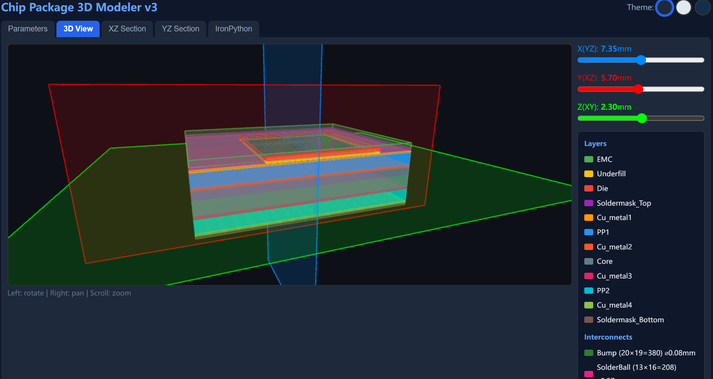
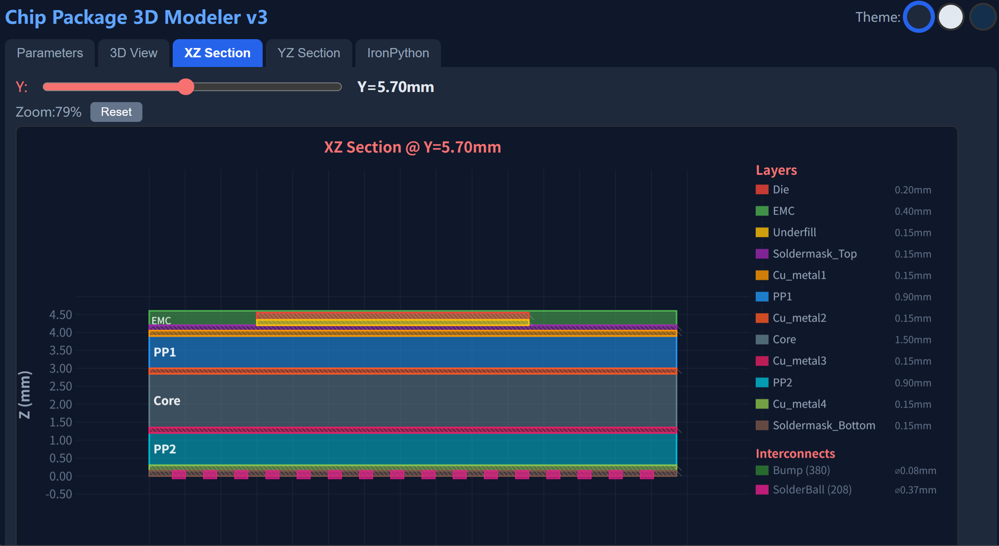
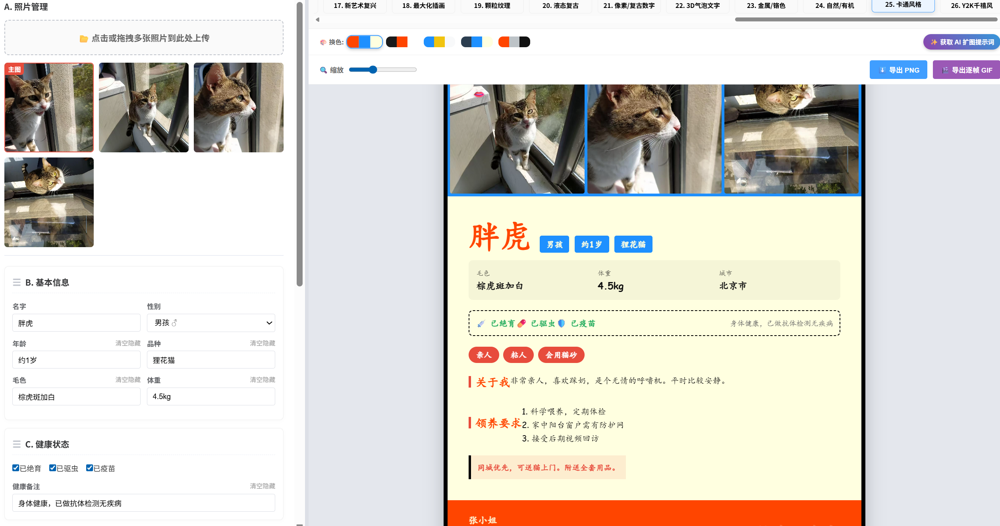

# 📐 需求捕手 ReqCatcher - OpenClaw Skill

[](https://github.com/openclaw/openclaw)
[](LICENSE)

> **🎯 你的 AI 产品架构师 · 模糊需求终结者**

An OpenClaw Skill for interactive requirement clarification. Inspired by product engineering best practices, this skill helps transform vague user requests into well-defined, actionable specifications through structured dialogue.

---

## Overview

**Problem**: Most AI agent failures stem not from capability limitations, but from misaligned expectations. When users say "help me build a tool," they often have implicit assumptions that agents cannot infer.

**Solution**: This skill implements a 3-phase requirement clarification protocol that ensures mutual understanding before execution begins.

> **Core Philosophy**: "Better to ask twice than execute wrong once."

---

## ✨ 三大核心能力

### 1️⃣ 渐进引导 Progressive Guidance
- **简单需求**：分轮次提问，快速对齐（每轮2-3个核心问题）
- **复杂需求**：对话式剥洋葱，逐步深入
- **先做功课**：主动提供建议，而非空白问卷

### 2️⃣ 参数化抽象 Parametric Abstraction
- **变量识别**：区分固定基准与动态变量
- **联动规则**：参数A变化时，B、C如何联动
- **边界矩阵**：实体重叠与布尔运算规则显性化

### 3️⃣ 毒舌纠偏 Brutal Honesty
- **可行性检查**：不切实际需求直接打回
- **强制二选一**：必须提供可行替代方案
- **零委婉**：明确告知不可行及原因

---

## 📚 实战案例

### 案例 1：电商后台需求澄清

**初始需求**："帮我做一个简单的电商后台管理系统"

**澄清过程**：
1. **第一轮**：确认后台类型（数据分析类 vs 文档类）+ 使用场景
2. **第二轮**：确认用户角色（管理员/运营/客服）+ 核心功能
3. **第三轮**：确认技术约束（平台/现有系统对接）

**输出规格**：
```markdown
## 需求规格文档

### [业务侧]
- 目标：B2C电商后台，支持商品/订单/用户管理
- 用户角色：超级管理员、运营人员、客服人员
- 核心功能：商品上架、订单处理、用户查询、数据报表

### [技术侧]  
- 技术栈：React + Node.js + MySQL
- 边界条件：支持并发100用户，数据每日备份
- 绝对禁区：不涉及支付系统（使用第三方支付）
```

---

### 案例 2：芯片封装几何建模（工业级复杂需求）

**初始需求**："设计一个芯片封装模型，能自动生成Ansys脚本"

**澄清过程**（参考芯片封装案例心法）：

**1. 参数化逼问**：
> "如果Die尺寸变了，Bump的行数和列数应该自动重算吗？"

**2. 物理空间逻辑确认**：
> "12层结构中，哪些是紧密堆叠的？修改某层高度时，其他层如何联动？"

**3. 边界重叠矩阵**：
| 被减体 | 减去 | 原因 |
|:---|:---|:---|
| EMC | Die | Die嵌入EMC内部 |
| EMC | Bump | Bump穿过EMC范围 |

**4. 可视化渐进确认**：
> "实现思路：前三层固定不可拖，基板层支持排序。接受吗？"

**输出规格**：
- 12层基板结构 + 380个Bump阵列 + 208个SolderBall阵列
- 参数化配置面板（直径/高度/间隔/基准面）
- Z-Offset自动联动机制
- 布尔运算规则确认表

**实际交付成果**：

*3D视图 - 多层结构及Bump/SolderBall阵列可视化*


*XZ截面图 - 层叠结构及参数化配置*


---

### 案例 3：猫咪领养海报生成器

**初始需求**："我想要一个猫咪领养海报生成器"

**澄清过程**（先做功课，再提问）：

**功课研究**（主动输出）：
> "我研究了8种设计风格，为你推荐3种：
> - **温馨治愈系**：柔和渐变、圆润字体，适用幼猫
> - **现代极简系**：大量留白、ins风，适用品种猫  
> - **赛博朋克系**：霓虹光效、科技感，适用黑猫
> 你倾向哪种？或我根据猫咪特点推荐？"

**分轮确认**：
1. **第一轮**：风格方向 + 尺寸需求
2. **第二轮**：字段配置（必填/可选）+ 拖拽需求
3. **第三轮**：动态效果（GIF/短视频/微交互）

**输出规格**：
- 32种设计风格（8体系×4配色）
- 可拖拽字段编辑器
- 静态+动态双模式
- 批量处理支持

**实际交付成果**：

*猫咪领养海报生成器 - 波普艺术风格预览*


功能展示：
- 10种艺术风格切换（新艺术运动/装饰艺术/包豪斯/波普艺术等）
- 实时换色（4种配色方案）
- 照片上传与管理
- 可拖拽字段编辑（基本信息/健康状态/领养要求）
- 导出PNG/JPG

---

## Installation

```bash
# Via SkillHub
skillhub install requirement-clarifier

# Or manually clone to your OpenClaw skills directory
git clone https://github.com/EvianEvans/requirement-clarifier.git
```

---

## Usage

Once installed, the skill automatically activates when:
- User makes vague requests ("help me build...", "I want a...", "create a...")
- Complex multi-step tasks are detected
- Requirements span multiple domains

### Three-Phase Protocol

```
Phase 1: 需求复杂度判定
    ├─ 分支A：简单需求 → 分轮次问卷（每轮2-3问）
    └─ 分支B：复杂需求 → 对话引导模式

Phase 1.5: 工程参数化抽象 (关键增强)
    ├─ 先做功课：研究后再问
    ├─ 参数化逼问：哪些是变量？
    ├─ 空间逻辑确认：谁贴着谁？
    ├─ 边界重叠矩阵：布尔运算规则
    └─ 可视化渐进确认

Phase 2: 可行性审查 (毒舌纠偏)
    └─ 不可行？→ 直接打回 + 强制二选一

Phase 3: 输出需求规格文档
    ├─ [业务侧] 给人看
    └─ [技术侧] 给机器看
```

---

## Domain-Specific Guides

| Domain | Key Questions |
|:-------|:--------------|
| 💻 Programming | Tech stack, environment, new vs existing code, API needs |
| 📊 Data Analysis | Data source/format, analysis purpose, key metrics, visualization needs |
| ✍️ Content Creation | Target audience, tone, length, reference style, publishing channel |
| 🎨 Design | Design type, brand guidelines, user scenario, competitor references |
| 🏭 Engineering | 参数化建模、空间堆叠关系、物理边界条件 |

---

## 📁 Directory Structure

```
requirement-clarifier/
├── SKILL.md                 # Skill definition & workflow
├── README.md                # This file
├── LICENSE                  # MIT License
├── CONTRIBUTING.md          # Contribution guidelines
├── assets/                  # Static assets
├── references/              # Reference materials
│   ├── domain-templates.md  # Domain-specific templates
│   ├── case-studies.md      # Case study collection
│   └── case-study-ansys.md  # Ansys parametric modeling case
└── scripts/                 # Utility scripts
```

---

## 🔧 Configuration

No configuration required. The skill works out-of-the-box once installed.

---

## 🧠 Integration with Memory

After each clarification session, key points are written to MEMORY.md:
- Core objectives and constraints
- User-emphasized requirements
- Agreed execution plan
- Follow-up questions

This enables context recovery if conversations are interrupted.

---

## 💡 Why This Matters

| Without Clarification | With ReqCatcher |
|:---------------------|:----------------|
| "Build me a website" → Generic result | "Build me a website" → Structured requirements → Tailored result |
| Multiple revision cycles | Get it right the first time |
| User frustration | User confidence |
| Wasted tokens | Efficient execution |

---

## 🤝 Related Skills

- **feynman-learner**: For educational scenarios where the user teaches the AI
- **universal-summarizer**: For distilling large documents into key points

---

## 👥 Contributing

Contributions welcome! See [CONTRIBUTING.md](CONTRIBUTING.md) for details.

Areas for improvement:
- Additional domain-specific question templates
- More case studies in references/
- Multilingual support
- Integration with project management tools

---

## 📄 License

MIT License - See [LICENSE](LICENSE) file for details

---

## 👤 Author

Created with ❤️ for the OpenClaw ecosystem.

🦞 **Think twice, code once.**

---

**Note**: This skill embodies the principle that "the quality of output is determined by the quality of understanding." Take the time to clarify upfront, and save time on revisions later.
